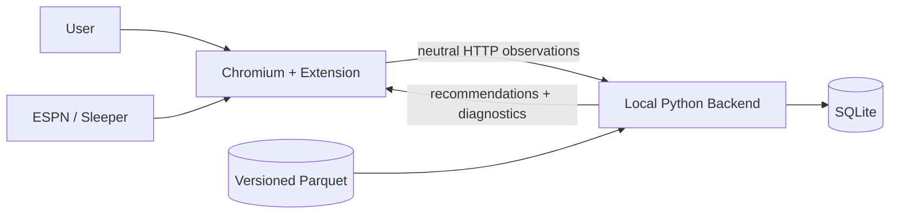

# Architecture Overview

## System context

The assistant is a local companion to a supported fantasy draft. The fantasy platform remains the source of observed league activity; the assistant does not automate selections or bypass platform access controls.



## Containers and ownership

### Extension

- **Platform adapter:** knows hostnames, platform IDs, documented provider requests, page state,
  selectors, and extraction fallbacks. Provider-specific behavior remains in this boundary.
- **Content layer:** hosts adapter lifecycle and renders UI without making fantasy decisions.
- **Service worker:** holds no irreplaceable in-memory state; relays authenticated localhost calls,
  holds extension configuration, and performs a validated adapter's structured provider requests.
- **API client:** serializes only neutral protocol types.
- **UI:** renders status, freshness, recommendations, explanations, and recoverable failures.

The extension may cache non-authoritative configuration in `chrome.storage`. It never owns canonical picks, the full player dataset, identity mappings, or scoring strategy.

### Backend

- **API:** authenticates, validates, translates transport models, and maps domain outcomes to HTTP.
- **Domain:** owns league/draft behavior and depends on no web framework or database implementation.
- **Identity:** resolves provider references to internal draftable assets (individual players and team defenses) and records unresolved observations.
- **Data:** ingests and curates external data offline; exposes stable prepared records to runtime code.
- **Projection:** estimates position- and asset-aware fantasy production independently of draft context.
- **Valuation:** combines projection and explicitly configured market priors.
- **Draft engine:** applies current league, availability, roster, pick timing, scarcity, and risk.
- **Persistence:** implements repositories for canonical state, provenance, and recommendation snapshots.

### Storage

- **SQLite:** mutable application state, mappings/exceptions, metadata, and recommendation history.
- **Parquet:** immutable or replaceable versioned curated datasets, features, and prepared asset values.
- **Configuration:** non-secret model parameters are versioned; secrets and machine-local paths remain outside version control.

## Dependency direction

```text
extension UI/content -> neutral extension protocol types <- platform adapters

backend API/persistence/data adapters
              |
              v
        application services
              |
              v
          domain model

projection -> valuation -> draft decision
```

Outer adapters may depend inward. Domain code must not import FastAPI, SQLite, Polars/nflreadpy
records, browser concepts, or platform-specific objects. Projection does not depend on a draft
session; draft decisions consume prepared asset value rather than raw historical rows.

## Runtime flows

### Initialize or resume

1. The adapter detects the surface and obtains a league/draft snapshot from its validated source.
2. The service worker verifies backend health and submits the snapshot with neutral references.
3. The API authenticates and validates it.
4. The application service creates or loads the matching draft, resolves identities, and reconciles picks.
5. Canonical state is committed before recommendations are calculated.
6. The response identifies unresolved observations and returns current recommendations or an explicit blocked/degraded state.

### Process a pick

1. The adapter emits a deterministic event ID and platform player reference.
2. The backend returns the established result immediately if that event has already been accepted.
3. Otherwise it resolves the player and validates the transition against canonical state.
4. State and the event outcome are committed atomically.
5. The engine calculates recommendations from prepared values and current state.
6. The recommendation snapshot and its provenance are persisted before the response is rendered.

### Reconcile and recover

- Snapshot reconciliation compares picks by stable pick number, team, and resolved player identity.
- It may append missing unambiguous picks and reprocess derived availability/rosters.
- It must not silently replace conflicting accepted history; unresolved conflicts stop recommendation freshness and are surfaced.
- A page reload or service-worker restart submits a fresh snapshot and resumes the backend session.
- A backend restart reloads the last committed state before accepting new observations.

## Offline versus live processing

Offline jobs download data, normalize identities, create features/projections, validate outputs, and publish a complete versioned dataset. The live runtime loads one published version when the draft starts and pins it for that session. Refreshing data or model parameters mid-draft requires an explicit new session/version decision; it never happens silently.

## Platform-adapter strategy

Use, in order, an appropriate documented read-only provider API accessed by the extension adapter,
structured network responses already consumed by the page, browser-observable application state,
and finally DOM parsing. Do not infer completeness from virtualized player lists. Fixtures must be
sanitized captures, and adapter parsing must be testable without a live site.

The Sleeper adapter follows this order. Its service worker may call Sleeper's documented read-only
API after exact-surface activation and validated local configuration; it sends only neutral
observations to the backend. The backend does not call Sleeper directly. See
[ADR-0002](decisions/0002-extension-bound-provider-api-access.md).

Implement only capabilities required by the active supported surface. A second adapter must conform to the neutral protocol but does not justify a universal provider framework.

## Deployment and evolution

The MVP runs one backend bound to loopback and one local extension. WebSockets, cloud services, additional databases, distributed queues, and remote telemetry are absent until a measured requirement justifies them. In-season engines may reuse data and identity capabilities but remain distinct application modules.
